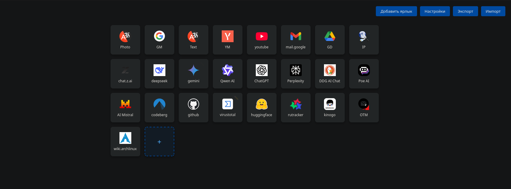

### Замена стартовой страницы в Librewolf (Arch Linux)



**Цель:** Заменить стандартную стартовую страницу на пользовательский HTML-файл.

❗️ После изменения стартовой страницы, происходит разлогивание на всех сайтах.

---

#### Шаг 1: Создание файла `autoconfig.js`

```bash
sudo nano /usr/lib/librewolf/defaults/pref/autoconfig.js
```

**Содержимое файла:**

```javascript
pref("general.config.filename", "librewolf.cfg");
pref("general.config.obscure_value", 0);
pref("general.config.sandbox_enabled", false);
```

**Проверка прав:**

```bash
cd /usr/lib/librewolf/defaults/pref/
stat --format='%a %n' autoconfig.js  # Должно быть: 644
```

---

#### Шаг 2: Редактирование файла `librewolf.cfg`

```bash
sudo nano /usr/lib/librewolf/librewolf.cfg
```

**Добавить в самое начало файла:**

```javascript

null;

const base_page = "file:///home/New_tab/index.html";

//
try {
  const ctx = {};
  ChromeUtils.defineESModuleGetters(ctx, {
    AboutNewTab: "resource:///modules/AboutNewTab.sys.mjs"
  });
  ctx.AboutNewTab.newTabURL = base_page;
} catch (e) {
  ChromeUtils.reportError(e);
}

lockPref("browser.startup.homepage", base_page);
lockPref("browser.startup.page", 3);
lockPref("browser.startup.homepage_override.mstone", "ignore");
lockPref("browser.newtabpage.activity-stream.aboutHome.enabled", false);

/** ------------------------------
* My settings. Changes base page.
* ------------------------------- */
```

**Важно:**

* Первая строка — пустая (а потом уже `null;` и остальное).
* Путь `file:///home/New_tab/index.html` заменить на свой.
* Проверка прав:

  ```bash
  cd /usr/lib/librewolf/
  stat --format='%a %n' librewolf.cfg  # Должно быть: 644
  ```

---

#### Шаг 3: Перезапуск Librewolf

Закройте все процессы браузера и запустите его снова. При открытии новой вкладки будет загружена страница:
`file:///home/New_tab/index.html`.

> **Примечание:**
>
> * Убедитесь, что путь к HTML-файлу корректен.
> * Для отката удалите добавленные строки из `librewolf.cfg`.

---

### Добавление локальных иконок ярлыков (fetch\_icons.py)

**Цель:** скачать все иконки из экспортированного JSON (файл экспорта из новой вкладки) в локальную папку и заменить поля `icon` в JSON на локальные пути.

**Кратко:** скрипт `fetch_icons.py` читает JSON-массив ярлыков `{title, url, icon}`, скачивает доступные иконки в указанную директорию (сохранение под именем, основанным на `title`, поддерживаются русские/юникодные имена), делает резервную копию исходного JSON (`*.bak`) и перезаписывает исходный JSON, подставляя локальные пути к сохранённым иконкам.

**Особенности:**

* Поддержка юникода (русские названия сохраняются как имена файлов, если файловая система это позволяет).
* При невозможности сохранить юникодное имя — автоматически используется ASCII-резервное имя (fallback).
* Скрипт создаёт резервную копию исходного JSON (`bookmarks.json.bak`) перед перезаписью.
* По умолчанию при ошибке скачивания исходный URL в поле `icon` **не затирается** (чтобы не потерять данные). Можно изменить поведение при необходимости.
* В JSON записывается `ensure_ascii=False`, то есть русские строки остаются читаемыми.

**Зависимости:**

```bash
uv add requests tqdm
```

(Если вы используете другой менеджер/окружение — установите эквивалентные пакеты.)

**Пример использования:**

```bash
uv run fetch_icons.py \
  --input /path/to/bookmarks_export.json \
  --outdir /home/New_tab/icons/ \
  --no-backup
```

**Опции:**

* `--input, -i` — путь к JSON-файлу экспорта (обязательный).
* `--outdir, -o` — каталог для сохранения иконок (обязательный).
* `--workers, -w` — число параллельных загрузок (по умолчанию 8).
* `--timeout` — таймаут HTTP-запроса в секундах (по умолчанию 8).
* `--no-backup` — не создавать резервную копию `.bak`.
* `--relative` — записать в JSON относительные пути к иконкам (относительно расположения JSON) вместо абсолютных путей.

**Пример с относительными путями (удобно для переносимости):**

```bash
uv run fetch_icons.py --input bookmarks.json --outdir /home/New_tab/icons --relative
```

**Права доступа:**

* Убедитесь, что у каталога для иконок есть права на запись для пользователя, который запускает скрипт.
* Если вы затем запускаете HTML-страницу из-под другого пользователя или через систему, убедитесь, что браузер/пользователь имеют права на чтение этих файлов.

**Примечания:**

* Если JSON получает абсолютные локальные пути (`/home/jon/.../icons/Photo.png`), ваш локальный HTML (загружаемый через `file:///...`) сможет использовать их напрямую в `img src`.
* Если вы предпочитаете относительные ссылки (например `icons/Photo.png`), используйте флаг `--relative` и поместите JSON и папку `icons/` в одной директории.

**Примечание безопасности:**

* Скрипт загружает произвольные URL-адреса. Убедитесь, что файл экспорта надёжен и не содержит вредоносных ссылок. Скрипт не выполняет проверку содержимого (только сохраняет файлы как байты).

---

>
